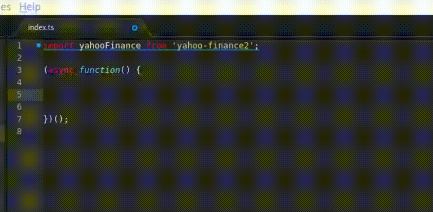

# node-yahoo-finance2

Community API for Yahoo-Finance.

Copyright (c) 2021 by Gadi Cohen &lt;dragon@wastelands.net&gt;.  [MIT licensed](./LICENSE).

[](https://www.npmjs.com/package/yahoo-finance2) [](https://circleci.com/gh/gadicc/node-yahoo-finance2) [](https://codecov.io/gh/gadicc/node-yahoo-finance2) [](https://github.com/semantic-release/semantic-release) [](http://www.typescriptlang.org/) [](./LICENSE)

Supports Node 12.0.0 and up (tests are run against 12.0.0).

**Beta release**.  Please let us know of any issues or edge cases.
If you're looking for something stable and battle-tested, use the
current
[node-yahoo-finance](https://www.npmjs.com/package/yahoo-finance).

[Live Demo on CodeSandbox](https://codesandbox.io/s/yahoo-finance2-312x2?file=/src/index.ts)

## Unofficial API

This project is neither created nor endorsed by Yahoo Inc.  Yahoo does not
provide any official API to developers, nor makes any guarantees regarding
service availability or API consistency.  In practice however, the open
source community has kept this project (and it's predecessor) working well
since 2013.

Nevertheless, we make no guarantees and you use this package at your own risk.
The developers (and obviously Yahoo) cannot be held responsible for any losses
you may incur as a result of using this service.  Use of this package is
considered acknowledgement and acceptance of these terms and of it's license.

## Quickstart

**CLI** (Command line interface)

```bash
$ npx yahoo-finance2 search AAPL

# or install it
$ npm install -g yahoo-finance2
$ yahoo-finance search AAPL '{ "someOption": true }'
```

**Importing**

```js
// Import the entire library or the specific module you need
import { search } from 'yahoo-finance2';
import search from 'yahoo-finance2/api/search';

const results = await search('AAPL');
const results = await search('AAPL', { someOption: true, etc });
```

Available modules:
[`autoc`](./docs/autoc.md),
[`historical`](./docs/historical.md),
[`quoteSummary`](./docs/quoteSummary.md), (submodules:
assetProfile, balanceSheetHistory, balanceSheetHistoryQuarterly,
calendarEvents, cashflowStatementHistory, cashflowStatementHistoryQuarterly,
defaultKeyStatistics, earnings, earningsHistory, earningsTrend, financialData,
fundOwnership, fundPerformance, fundProfile, incomeStatementHistory,
incomeStatementHistoryQuarterly, indexTrend, industryTrend, insiderHolders
insiderTransactions, institutionOwnership, majorDirectHolders,
majorHoldersBreakdown, netSharePurchaseActivity, price, quoteType,
recommendationTrend, secFilings, sectorTrend, summaryDetail, summaryProfile,
symbol, topHoldings, upgradeDowngradeHistory),
[`search`](./docs/search.md), with more
[coming soon](https://github.com/gadicc/node-yahoo-finance2/issues/8).

[Documentation](./docs/README.md) coming soon.

## (Optional) TypeScript Love

Working with `yahoo-finance2` is a joy if you're using TypeScript (but you
don't have to), with type checking and auto completion:



Try it yourself on our
[Live CodeSandbox](https://codesandbox.io/s/yahoo-finance2-312x2?file=/src/index.ts).

## Devel Mode

In "devel" mode, any URL will only be fetched *once* and cached in memory
and on the disk.  All future requests (for the rest of time) will return the
cached result. This is very helpful to speed up development and is used
extensively for our tests.

```js
await search('AAPL', {}, { devel: true });                // uses sha1 from URL
await search('AAPL', {}, { devel: 'search-AAPL.json' });  // fixed filename
```

Note: `require('yahooFinanceFetchDevel')` is called conditionally when
`devel: true`.  It also uses packages from `devDependencies`.  As such,
deployment to production is not supported.

## Contributing

Pull Requests welcome!  Please read [CONTRIBUTING.md](./CONTRIBUTING.md)
to avoid friction :)  Mostly importantly, PRs should be submitted against
the **devel branch** (our default branch) and **commit messages** should follow
the [conventionalcommits](https://www.conventionalcommits.org/) standard
(basically Angular).  This is important as we use
[semantic-release](https://github.com/semantic-release/semantic-release)
to automate releases and [CHANGELOG](./CHANGELOG.md) entries when we merge
back to master.

## Credits

* Massive thanks to [@pilwon](https://github.com/pilwon) for the original
[node-yahoo-finance](https://www.npmjs.com/package/yahoo-finance)
and for all our prior collaborations on this and other projects 🙏
